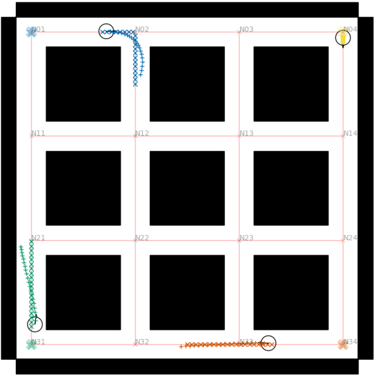

# Collision-Free Control for A Robot Fleet with Time-Constrained Scheduling


## Publication
The paper is accepted by the IEEE/SICE International Symposium on System Integration (SII 2026): [arXiv](https://arxiv.org/abs/2510.23129) \
Bibtex citation:
```
@misc{roselli_2025_schempc,
      title={Combining High Level Scheduling and Low Level Control to Manage Fleets of Mobile Robots}, 
      author={Sabino Francesco Roselli and Ze Zhang and Knut Åkesson},
      year={2025},
      eprint={2510.23129},
      archivePrefix={arXiv},
      primaryClass={cs.RO},
      url={https://arxiv.org/abs/2510.23129}, 
}
```



## Quick Start
### Gurobi
The scheduler is formulated as a MILP and solved using [Gurobi Optimizer](https://www.gurobi.com/). We recommend using the [academic named-user license](https://support.gurobi.com/hc/en-us/articles/13207658935185-How-do-I-retrieve-an-Academic-Named-User-license) for convenience. 


### OpEn
The NMPC formulation is solved using open source implementation of PANOC, namely [OpEn](https://alphaville.github.io/optimization-engine/). Follow the [installation instructions](https://alphaville.github.io/optimization-engine/docs/installation) before proceeding. 

### Install dependencies
It is recommended to use UV for managing Python environments. Create a new environment and install the dependencies using
```
uv pip install -r requirements.txt
```
or using pip directly
```
pip install -r requirements.txt
```

### Generate MPC solver
Go to "build_solver.py", change the configuration files to what you want and run
```
python src/build_solver.py
```
After this, a new directory *mpc_solver* will appear and contain the solver. Then, you are good to go :)

## Use Case
Run *main.py* for ... 

<!-- ## ROS Simulation
[ROS XXX](https://github.com/) [Not Yet] -->

## Components
The whole system is mainly composed of five components:
- **Scheduler**: The scheduler ("pkg_schedule") is responsible for generating global paths for each robot. 
- **Map**: The map ("basic_map") is responsible for *(a)* reading and processing map data into geometric map objects or occupancy grid maps; *(b)* reading and generating Networkx graphs storing map nodes and edges. 
- **Obstacle**: The obstacle ("basic_obstacle") is responsible for modeling and processing obstacles.
- **MPC**: The MPC ("pkg_mpc_tracker") is responsible for solving the NMPC problem and generating control inputs for each robot.
- **pkg_path_plan**: The path planner ("pkg_path_plan") is responsible for generating local paths for each robot. It also contains a global path planner to substitute the scheduler in case the scheduler is not available.

## Scheduler or Path Planner
The global guidance for mobile robots has two alternatives from either the scheduler or the global path planner.
1. The scheduler takes a schedule file (CSV) as input and generates global paths for each robot. The schedule file contains at least three columns: `robot_id`, `node_id`, and `time`.
2. The global path planner takes a start node and a goal node as input and generates a global path for the robot.

